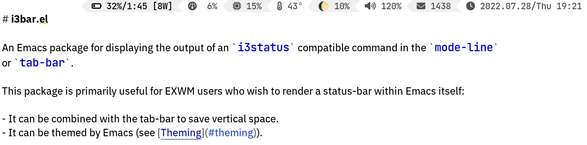

# i3bar.el

An Emacs package for displaying the output of an `i3status` compatible command in the `mode-line`
or `tab-bar`.

This package is primarily useful for EXWM users who wish to render a status-bar within Emacs itself:

- It can be combined with the tab-bar to save vertical space.
- It can be themed by Emacs (see [Theming](#theming)).

## Installation

`i3bar` is available on [MELPA](https://melpa.org/#/i3bar).

1. Install and configure an [i3status compatible status-bar generator](https://wiki.archlinux.org/title/I3#i3status).
2. Install any required fonts (likely `ttf-font-awesome`).
3. Install and configure this package.

```elisp
(use-package i3bar
  :ensure t ; assumes you have enabled MELPA per https://melpa.org/#/getting-started
  ;; Or with straight:
  ;:straight (i3bar :type git :host github :repo "Stebalien/i3bar.el")
  :config
  (i3bar-mode 1))
```

## Screenshot



## Tab Bar

You can place the i3bar in the tab-bar as follows:

```elisp
(use-package tab-bar
  :custom
  (tab-bar-format '(tab-bar-format-tabs        ; Optional: Remove to _only_ display the bar.
                    tab-bar-format-align-right ; Optional: Remove to align left.
                    tab-bar-format-global))
  :config
  (tab-bar-mode 1))
```

## Theming

By default, this package uses the colors specified by your `i3status` command. However, you can
define a custom `i3bar-face-function` to override this.

For example, I use the following theme with `i3status-rust`:

```toml
idle_bg = "#000000"
idle_fg = "#aaaaaa"
info_bg = "#000000"
info_fg = "#bbbbbb"
good_bg = "#000000"
good_fg = "#cccccc"
warning_bg = "#000000"
warning_fg = "#eeeeee"
critical_bg = "#000000"
critical_fg = "#ffffff"
separator = "\ue0b2"
alternating_tint_bg = "#111111"
separator_bg = "auto"
separator_fg = "auto"
```

Then I use the following "theme" function to make the status-bar's theme match my Emacs theme:

```elisp
(defun i3bar-face-function-theme (foreground background)
  (list
    (pcase (and foreground (upcase foreground))
      ("#000000" `(:foreground ,(face-background 'default nil t)))
      ("#111111" `(:foreground ,(face-background 'hl-line nil t)))
      ("#AAAAAA" 'shadow)
      ("#BBBBBB" nil)
      ("#CCCCCC" 'success)
      ("#EEEEEE" 'warning)
      ("#FFFFFF" 'error))
    (pcase (and background (upcase background))
      ("#000000" nil)
      ("#111111" 'hl-line))))

(custom-set-variables '(i3bar-face-function i3bar-face-function-theme))
```

## I3status Configuration

### [`i3status`](https://github.com/i3/i3status)

You need to create a `~/.config/i3status/config` file that explicitly sets the output format to "i3bar":

```text
general {
        output_format = "i3bar"
        colors = true
        interval = 5
}

order += "battery all"
order += "memory"
order += "tztime local"

battery all {
        format = "%status %percentage %remaining"
}
memory {
        format = "%used | %available"
        threshold_degraded = "1G"
        format_degraded = "MEMORY < %available"
}

tztime local {
        format = "%Y-%m-%d %H:%M:%S"
}
```


## Known Issues

This package is missing featuers and features and has some rough edges. I'm happy to accept patches
for any of these issues, assuming the patches don't introduce _other_ issues.

### Unimplemented Features

This package implements just enough of the i3status protocol to be useful, but not everything.

- Click Events
- Pixel Spacing
- Pango Markup

### Fonts & Icons

This package makes no attempt to correctly configure fonts. Ideally it would create a special
font-set that would "do the right thing", but my understanding of such black arts are still quite
limited.
